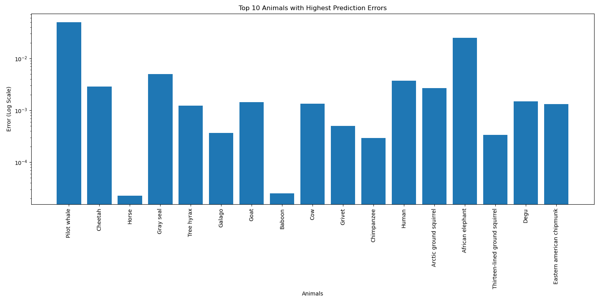

# Top 10 Sleep Perdiction Errors
Analyzes top 10 animals with highest sleep prediction errors (logarithmic scale).

This project uses multiple linear regression to predict sleep duration for various animal species based on selected physiological attributes. The project then visualizes the top 10 animals with the highest prediction errors in a bar plot, with error values shown on a logarithmic scale for clarity.

## Table of Contents

- [Project Overview](#project-overview)
- [Dependencies](#dependencies)
- [Example Output](#example-output)

## Project Overview

The main components of this project are:

1. **Multiple Linear Regression**: A model is trained to predict the sleep duration of animals based on attributes such as body weight, brain weight, and dietary category.
2. **Error Analysis**: The prediction errors (absolute difference between predicted and actual sleep values) are calculated for each animal.
3. **Bar Plot Visualization**: A bar plot displays the top 10 animals with the highest prediction errors, with the y-axis shown in logarithmic scale for better visibility of error values.

## Dependencies

- Python 3.x
- pandas
- numpy
- scikit-learn
- matplotlib

## Example Output

Below is the bar plot of the top 10 animals with the highest prediction errors using a logarithmic scale on the y-axis.

